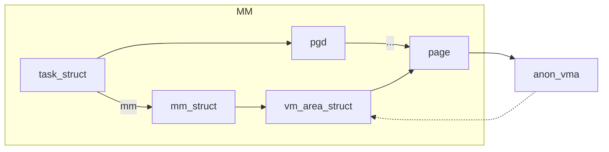
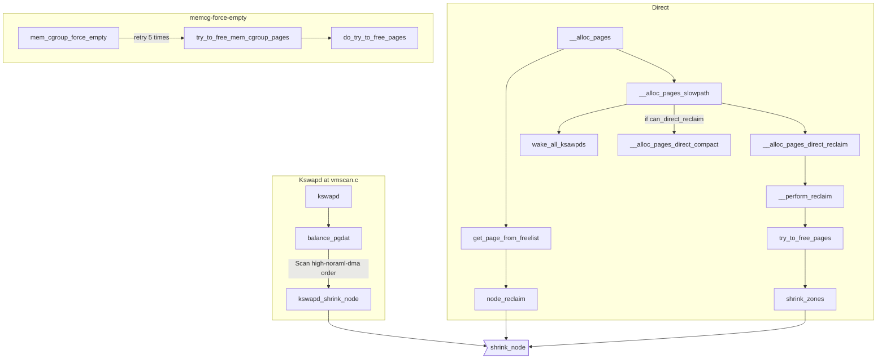
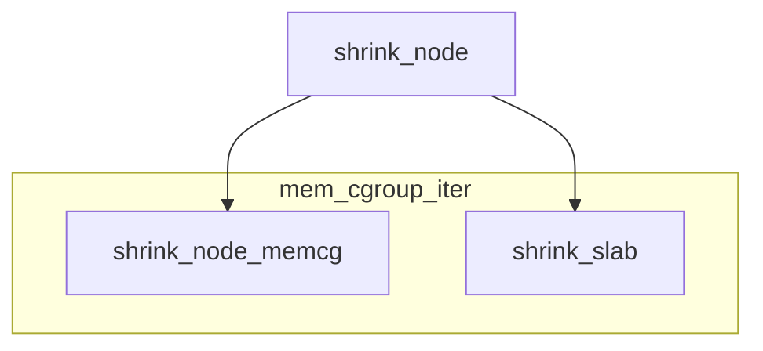
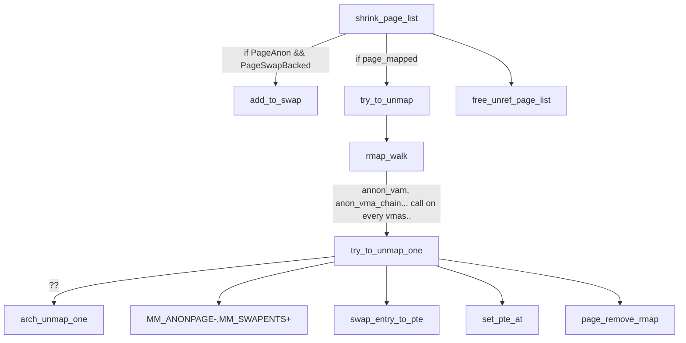

# Helloworld


# Memory Reclaim 101
This is a short note explaining memory reclaim flow in linux kernel.

## Reverse map
Page doesn't know which processes share itself because it doesn't have shared mapping info.




```c
static void __page_set_anon_rmap(struct page *page,
	struct vm_area_struct *vma, unsigned long address, int exclusive)
{
	struct anon_vma *anon_vma = vma->anon_vma;

	BUG_ON(!anon_vma);

	if (PageAnon(page))
		return;

	/*
	 * If the page isn't exclusively mapped into this vma,
	 * we must use the _oldest_ possible anon_vma for the
	 * page mapping!
	 */
	if (!exclusive)
		anon_vma = anon_vma->root;

	anon_vma = (void *) anon_vma + PAGE_MAPPING_ANON;
	page->mapping = (struct address_space *) anon_vma;
	page->index = linear_page_index(vma, address);
}
```


# Reclaiming
1. Low on memory
   1. alloc_page_buffers()
   2. __aloc_pages()
2. Hibernation
   1. pm_suspend_disk()
3. Periodic
   1. kswapd
   2. cache_reap() at slab.c




> kswapd scans the zones in the highmem->normal->dma direction.


## Scan controll diff

```c
static int balance_pgdat(pg_data_t *pgdat, int order, int classzone_idx)
{
	int i;
	unsigned long nr_soft_reclaimed;
	unsigned long nr_soft_scanned;
	unsigned long pflags;
	struct zone *zone;
	struct scan_control sc = {
		.gfp_mask = GFP_KERNEL,
		.order = order,
		.priority = DEF_PRIORITY,
		.may_writepage = !laptop_mode,
		.may_unmap = 1,
		.may_swap = 1,
	};

unsigned long try_to_free_pages(struct zonelist *zonelist, int order,
				gfp_t gfp_mask, nodemask_t *nodemask)
{
	unsigned long nr_reclaimed;
	struct scan_control sc = {
		.nr_to_reclaim = SWAP_CLUSTER_MAX,
		.gfp_mask = current_gfp_context(gfp_mask),
		.reclaim_idx = gfp_zone(gfp_mask),
		.order = order,
		.nodemask = nodemask,
		.priority = DEF_PRIORITY,
		.may_writepage = !laptop_mode,
		.may_unmap = 1,
		.may_swap = 1,
	};

unsigned long try_to_free_mem_cgroup_pages(struct mem_cgroup *memcg,
					   unsigned long nr_pages,
					   gfp_t gfp_mask,
					   bool may_swap)
{
	struct zonelist *zonelist;
	unsigned long nr_reclaimed;
	unsigned long pflags;
	int nid;
	unsigned int noreclaim_flag;
	struct scan_control sc = {
		.nr_to_reclaim = max(nr_pages, SWAP_CLUSTER_MAX),
		.gfp_mask = (current_gfp_context(gfp_mask) & GFP_RECLAIM_MASK) |
				(GFP_HIGHUSER_MOVABLE & ~GFP_RECLAIM_MASK),
		.reclaim_idx = MAX_NR_ZONES - 1,
		.target_mem_cgroup = memcg,
		.priority = DEF_PRIORITY,
		.may_writepage = !laptop_mode,
		.may_unmap = 1,
		.may_swap = may_swap,
	};

unsigned long mem_cgroup_shrink_node(struct mem_cgroup *memcg,
						gfp_t gfp_mask, bool noswap,
						pg_data_t *pgdat,
						unsigned long *nr_scanned)
{
	struct scan_control sc = {
		.nr_to_reclaim = SWAP_CLUSTER_MAX,
		.target_mem_cgroup = memcg,
		.may_writepage = !laptop_mode,
		.may_unmap = 1,
		.reclaim_idx = MAX_NR_ZONES - 1,
		.may_swap = !noswap,
	};

unsigned long shrink_all_memory(unsigned long nr_to_reclaim)
{
	struct reclaim_state reclaim_state;
	struct scan_control sc = {
		.nr_to_reclaim = nr_to_reclaim,
		.gfp_mask = GFP_HIGHUSER_MOVABLE,
		.reclaim_idx = MAX_NR_ZONES - 1,
		.priority = DEF_PRIORITY,
		.may_writepage = 1,
		.may_unmap = 1,
		.may_swap = 1,
		.hibernation_mode = 1,
	};

static int __node_reclaim(struct pglist_data *pgdat, gfp_t gfp_mask, unsigned int order)
{
	/* Minimum pages needed in order to stay on node */
	const unsigned long nr_pages = 1 << order;
	struct task_struct *p = current;
	struct reclaim_state reclaim_state;
	unsigned int noreclaim_flag;
	struct scan_control sc = {
		.nr_to_reclaim = max(nr_pages, SWAP_CLUSTER_MAX),
		.gfp_mask = current_gfp_context(gfp_mask),
		.order = order,
		.priority = NODE_RECLAIM_PRIORITY,
		.may_writepage = !!(node_reclaim_mode & RECLAIM_WRITE),
		.may_unmap = !!(node_reclaim_mode & RECLAIM_UNMAP),
		.may_swap = 1,
		.reclaim_idx = gfp_zone(gfp_mask),
	};

```

## Common part of shrink flow. shrink_node() detail

* scan_control.priority: how much of the queues will be scaned in one go. Def 12 == 1/4096th of the queue



## Kswapd Scan Controll

at balance_pgdat()

Default SC
```c
struct scan_control sc = {
		.gfp_mask = GFP_KERNEL,
		.order = order,
		.priority = DEF_PRIORITY,
		.may_writepage = !laptop_mode,
		.may_unmap = 1,
		.may_swap = 1,
	};
```
* sc.priority를 줄여가며 시도
* 
* may_writepage = 1 if DEF_PRIORITY - 2 (10) 보다 작다면...


# Shrink Page and unmapping flow




# Zone

```c

// Each node has pglist_data_t
struct pglist_data {
	struct zone node_zones[MAX_NR_ZONES];
	struct zonelist node_zonelists[MAX_ZONELISTS];
	int nr_zones;
	struct task_struct *kswapd;
	struct lruvec lruvec {
		struct list_head lists[NR_LRU_LISTS];	// LRU LIST
		...
		struct pglist_data *pgdat;	// For MEMCG
	};
	atomic_long_t vm_stat[NR_VM_NODE_STAT_ITEMS];
} pg_data_t;

struct zone {
	unsigned long watermark[NR_WMARK];
	struct pglist_data *zone_pgdat;
	struct free_area free_area[MAX_ORDER] {	// Buddy
		struct list_head free_list[MIGRATE_TYPES];
		unsigned long nr_free;
	}
	...
};
```

* spanned_pages > present_pages > managed_pages
** spanned = end_pfn - start_pfn
** present = spanned - hole
** managed = present - reserved

# Page

```c

struct page {
	union {
		// 1 page cache or anon page
		struct {
			struct list_head lru;
			struct address_space *mapping
			pgoff_t index;
			unsgined long private; // For buffer_head, swp_entry, PageBuddy...
		}
		// 2 slab, slob
		// 3 Tail pages of compound page
		// 4 Second tail page
		// 5 Page table pages
		// 6 Zone device pages
	}

	atomit_t _refcount;
	struct mem_cgroup *mem_cgroup;

}
```
